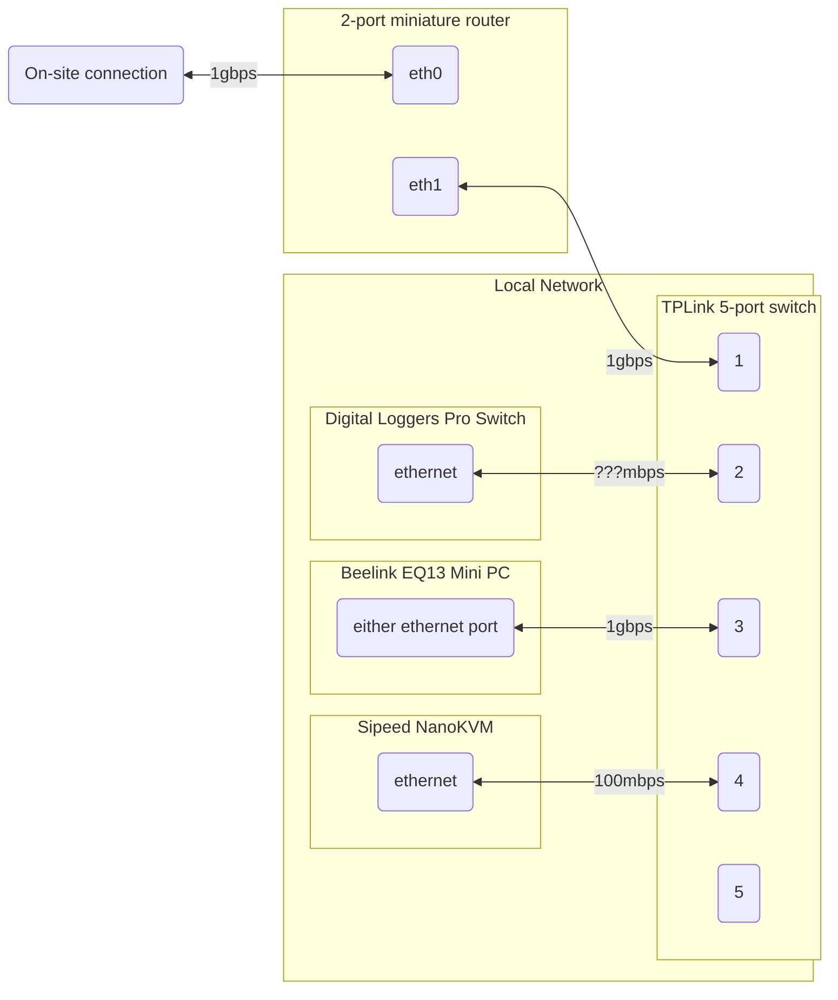

# Network Diagram

```mermaid
graph LR;
    wan(On-site connection)<--1gbps-->router-eth0;
    subgraph local-network [Local Network]
        subgraph switch [TPLink 5-port switch]
            switch-1(1);
            switch-2(2);
            switch-3(3);
            switch-4(4);
            switch-5(5);
        end
        subgraph power-strip [Digital Loggers Pro Switch]
            power-strip-ethernet(ethernet)<--???mbps-->switch-2;
        end
        subgraph pc [Beelink EQ13 Mini PC]
            beelink-ethernet(either ethernet port)<--1gbps-->switch-3;
        end
        subgraph kvm [Sipeed NanoKVM]
            nanokvm-ethernet(ethernet)<--100mbps-->switch-4;
        end
    end
    subgraph router [2-port miniature router]
        router-eth0(eth0);
        router-eth1(eth1)<--1gbps-->switch-1;
    end
```
