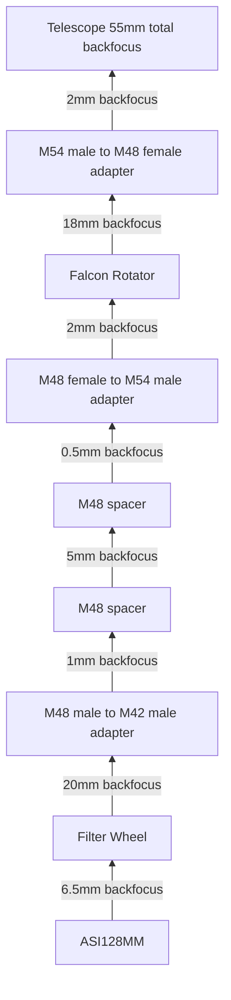

# Optical Train

```mermaid
graph BT;
    camera[ASI128MM]--6.5mm backfocus-->efw
    efw[Filter Wheel]--20mm backfocus-->m48mtom42m
    m48mtom42m[M48 male to M42 male adapter]--1mm backfocus-->5mmspacer
    5mmspacer[M48 spacer]--5mm backfocus-->halfmmspacer
    halfmmspacer[M48 spacer]--0.5mm backfocus-->m48tom54rear
    m48tom54rear[M48 female to M54 male adapter]--2mm backfocus-->rotator
    rotator[Falcon Rotator]--18mm backfocus-->m54tom48
    m54tom48[M54 male to M48 female adapter]--2mm backfocus-->telescope
    telescope[Telescope 55mm total backfocus]
```
