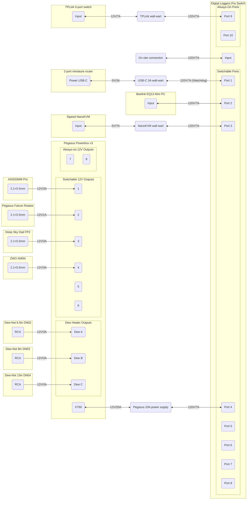

# Power Diagram

```mermaid
graph LR;
    vin(On-site connection)<--120V/?A-->power-strip-vin;
    subgraph power-strip [Digital Loggers Pro Switch]
        subgraph power-strip-switchable-ports [Switchable Ports]
            power-strip-port-1(Port 1);
            power-strip-port-2(Port 2);
            power-strip-port-3(Port 3);
            power-strip-port-4(Port 4);
            power-strip-port-5(Port 5);
            power-strip-port-6(Port 6);
            power-strip-port-7(Port 7);
            power-strip-port-8(Port 8);
        end
        subgraph power-strip-always-on-ports [Always-On Ports]
            power-strip-port-9(Port 9);
            power-strip-port-10(Port 10);
        end
        power-strip-vin(Input);
    end
    router-wall-wart(USB-C 3A wall-wart)<--120V/?A (Watchdog)-->power-strip-port-1;
    subgraph router [2-port miniature router]
        router-power(Power USB-C);
    end
    router-power<--5V/3A-->router-wall-wart;
    subgraph pc [Beelink EQ13 Mini PC]
        beelink-power(Input)<--120V/?A-->power-strip-port-2;
    end
    tplink-wall-wart(TPLink wall-wart)<--120V/?A-->power-strip-port-9;
    subgraph switch [TPLink 5-port switch]
        switch-power(Input);
    end
    switch-power<--12V/?A-->tplink-wall-wart;
    nanokvm-wall-wart(NanoKVM wall-wart)<--120V/?A-->power-strip-port-3;
    subgraph kvm [Sipeed NanoKVM]
        nanokvm-power(Input);
    end
    nanokvm-power<--5V/?A-->nanokvm-wall-wart;
    pegasus-wall-wart(Pegasus 20A power supply)<--120V/?A-->power-strip-port-4;
    subgraph pegasus-powerbox [Pegasus Powerbox v3]
        pegasus-powerbox-power(XT60);
        subgraph pegasus-powerbox-dew [Dew Heater Outputs]
            pegasus-powerbox-dew-a(Dew A);
            pegasus-powerbox-dew-b(Dew B);
            pegasus-powerbox-dew-c(Dew C);
        end
        subgraph pegasus-powerbox-switchable [Switchable 12V Outputs]
            pegasus-powerbox-12v-1(1);
            pegasus-powerbox-12v-2(2);
            pegasus-powerbox-12v-3(3);
            pegasus-powerbox-12v-4(4);
            pegasus-powerbox-12v-5(5);
            pegasus-powerbox-12v-6(6);
        end
        subgraph pegasus-powerbox-always-on [Always-on 12V Outputs]
            pegasus-powerbox-12v-7(7);
            pegasus-powerbox-12v-8(8);
        end
    end
    pegasus-powerbox-power<--12V/20A-->pegasus-wall-wart;
    subgraph camera [ASI533MM Pro]
        camera-cooler-power(2.1×5.5mm)--12V/3A-->pegasus-powerbox-12v-1;
    end
    subgraph rotator [Pegasus Falcon Rotator]
        rotator-power(2.1×5.5mm)--12V/1A-->pegasus-powerbox-12v-2;
    end
    subgraph flat-flap [Deep Sky Dad FP2]
        flat-flap-power(2.1×5.5mm)--12V/3A-->pegasus-powerbox-12v-3;
    end
    subgraph mount [ZWO AM5N]
        mount-power(2.1×5.5mm)--12V/3A-->pegasus-powerbox-12v-4;
    end
    subgraph dew-65-in [Dew-Not 6.5in DN02]
        dew-65-power(RCA)--12V/3A-->pegasus-powerbox-dew-a;
    end
        subgraph dew-9-in [Dew-Not 9in DN03]
        dew-9-power(RCA)--12V/3A-->pegasus-powerbox-dew-b;
    end
    subgraph dew-13-in [Dew-Not 13in DN04]
        dew-13-power(RCA)--12V/3A-->pegasus-powerbox-dew-c;
    end
```
