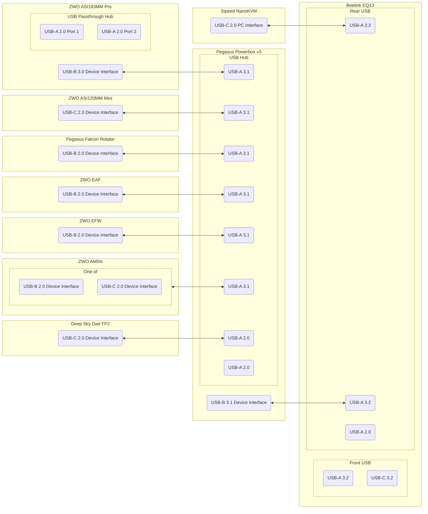

# USB Diagram

```mermaid
graph LR;
    subgraph main-camera [ZWO ASI183MM Pro]
        main-camera-usb(USB-B 3.0 Device Interface);
        subgraph main-camera-hub [USB Passthrough Hub]
            main-camera-hub-usb-1(USB-A 2.0 Port 1);
            main-camera-hub-usb-2(USB-A 2.0 Port 2);
        end
    end
    subgraph guide-camera [ZWO ASI120MM Mini]
        guide-camera-usb(USB-C 2.0 Device Interface);
    end
    subgraph rotator [Pegasus Falcon Rotator]
        rotator-usb(USB-B 2.0 Device Interface);
    end
    subgraph focuser [ZWO EAF]
        focuser-usb(USB-B 2.0 Device Interface);
    end
    subgraph filter-wheel [ZWO EFW]
        filter-wheel-usb(USB-B 2.0 Device Interface);
    end
    subgraph mount [ZWO AM5N]
        subgraph mount-one-of [One of]
            mount-usb-b(USB-B 2.0 Device Interface);
            mount-usb-c(USB-C 2.0 Device Interface);
        end
    end
    subgraph flat-flap [Deep Sky Dad FP2]
        flat-flap-usb(USB-C 2.0 Device Interface);
    end
    subgraph kvm [Sipeed NanoKVM]
        kvm-usb(USB-C 2.0 PC Interface);
    end
    subgraph pc [Beelink EQ13]
        subgraph pc-front-usb [Front USB]
            pc-front-usb-a(USB-A 3.2);
            pc-front-usb-c(USB-C 3.2);
        end
        subgraph pc-rear-usb [Rear USB]
            pc-rear-usb-a-1(USB-A 3.2);
            pc-rear-usb-a-2(USB-A 3.2);
            pc-rear-usb-a-2.0(USB-A 2.0);
        end
    end
    subgraph powerbox [Pegasus Powerbox v3]
        powerbox-usb-in(USB-B 3.1 Device Interface);
        subgraph powerbox-usb-out [USB Hub]
            powerbox-usb-out-1(USB-A 3.1);
            powerbox-usb-out-2(USB-A 3.1);
            powerbox-usb-out-3(USB-A 3.1);
            powerbox-usb-out-4(USB-A 3.1);
            powerbox-usb-out-5(USB-A 3.1);
            powerbox-usb-out-6(USB-A 3.1);
            powerbox-usb-out-7(USB-A 2.0);
            powerbox-usb-out-8(USB-A 2.0);
        end
    end
    main-camera-usb<-->powerbox-usb-out-1;
    guide-camera-usb<-->powerbox-usb-out-2;
    rotator-usb<-->powerbox-usb-out-3;
    focuser-usb<-->powerbox-usb-out-4;
    filter-wheel-usb<-->powerbox-usb-out-5;
    mount-one-of<-->powerbox-usb-out-6;
    flat-flap-usb<-->powerbox-usb-out-7;
    kvm-usb<-->pc-rear-usb-a-1;
    powerbox-usb-in<-->pc-rear-usb-a-2;
```
